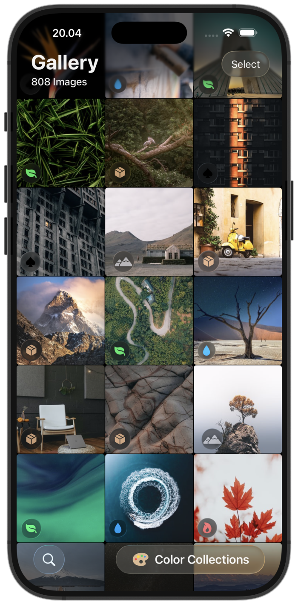
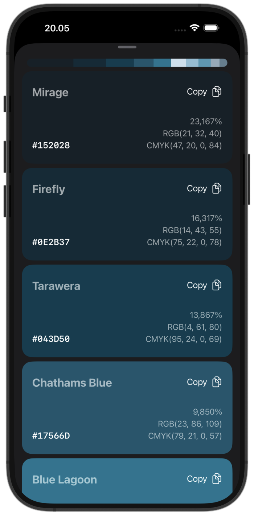
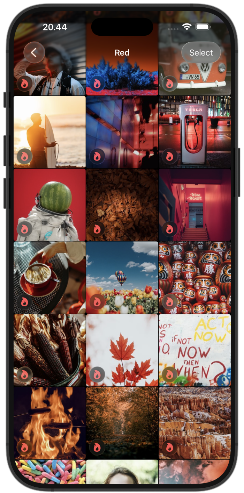
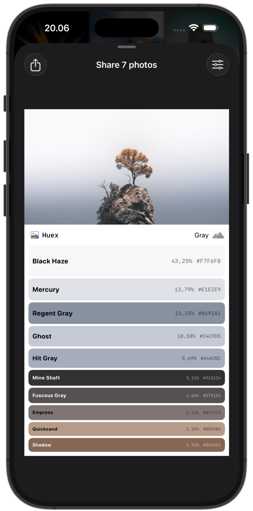

  

  # Huex

  Rediscover your memories through color. Huex reveals the hidden palettes in your photos, organizes your gallery by hue, and lets you share the unique visual story behind every moment, all processed privately on your device.
  
  <!-- Badges -->
  

    
    
    
    
  

---

## Overview

Huex started as a passion project born from a simple question: what if you could experience your photo library through color instead of just dates?

By analyzing every photo entirely on your device, Huex uncovers the dominant colors hidden in your memories, transforms them into beautiful palettes, and organizes your gallery into a vibrant spectrum. Whether you're searching for artistic inspiration or simply curious about the colors that define your life, Huex offers a playful new way to rediscover your camera roll.

### iOS Previews

  
  
  
  

## Support

If you have questions, want to chat about color algorithms, or would like to report a bug, feel free to reach out.

### Contact

- **Email:** [akbar@reishandy.id](mailto:akbar@reishandy.id)
- **Report an Issue:** [https://github.com/Reishandy/Huex/issues/new](https://github.com/Reishandy/Huex/issues/new)
- **Privacy Policy:** [https://policy.reishandy.id/#huex](https://policy.reishandy.id/#huex)

*Note: All photo processing happens locally on your device. Huex respects your privacy and does not upload your photos to any external servers.*

## Key Features

### Color Palette Extraction
* **Deep Color Analysis:** Instantly pulls the most dominant and striking colors from any photo to create a beautifully curated color palette.
* **Accurate Color Representation:** Goes beyond basic color averaging to ensure the colors pulled are vibrant, accurate, and avoid muddy mixtures.
* **Smart Grouping:** Accurately groups similar shades together to isolate the most distinct, visually pleasing hues in your image.
* **Fun Naming Dictionary:** Cross-references extracted colors against a massive dictionary to provide fun, human-readable names for every single shade.

### Image Categorization by Color
* **Automatic Sorting:** Sorts and groups your entire photo library based on primary color profiles, creating dedicated buckets for primary colors.
* **Seamless Performance:** Scans your library quietly in the background, ensuring the app remains fluid and responsive while you browse.
* **Instant Filtering:** Dynamically organizes your photos so you can instantly filter and find memories based purely on their dominant colors.

### Share with Palette
* **Social-Ready Exports:** Generates a beautiful layout that pairs your original photo alongside its extracted color palette strip.
* **High-Quality Layouts:** Seamlessly combines your high-resolution images and generated color swatches into a single, polished graphic entirely in-app.
* **Quick Sharing:** Effortlessly sends your newly generated artwork straight to the standard share sheet so you can post it anywhere.

## Technical Architecture

This project was built to explore the boundaries of local image processing and color theory within the Apple ecosystem.

* **Native SwiftUI UI:** Built entirely with SwiftUI, utilizing fluid layouts (`FlushGridView`, `Zoomable` modifiers) and modular feature components for a modern, responsive feel.
* **Framework Bridging:** 
  * **PhotoKit:** Interacts directly with `PHAsset` and `PHImageManager` via a centralized `PhotoStoreManager` to efficiently load, cache, and request image data with minimal memory overhead.
  * **CoreGraphics:** Powers the underlying pixel data extraction and image manipulation pipelines.
* **Custom Color Math Engine:** Implements custom utility classes (`ColorUtilities.swift`) to bridge the gap between standard `UIColor` outputs and advanced human-perception color models (CIELAB/LCh).
* **Modern Swift Concurrency:** Fully integrates Swift's native `async/await` and actor-isolated workers (`PhotoDataWorker`) to manage heavy pixel analysis asynchronously without blocking the main thread.
* **Domain-Driven Architecture:** Structured around clean MVVM and domain-driven design principles to separate raw data models (like `PhotoMetadata` and `PreviewData`) from presentation logic.
## Tech Stack

* **Framework:** SwiftUI
* **Language:** Swift 6
* **Data Management:** PhotoKit & Accelerate
* **Architecture:** Domain-Driven / SwiftUI Native
## License

This project is licensed under the MIT License. Feel free to explore the code, fork it, or learn from the color extraction utilities. See the LICENSE file for full details.

---

  <b>Created by Muhammad Akbar Reishandy</b> 
  <a href="mailto:akbar@reishandy.id">Email</a> |
  <a href="https://reishandy.id">Website</a> |
  <a href="https://github.com/Reishandy">GitHub</a> |
  <a href="https://www.linkedin.com/in/reishandy/">LinkedIn</a>

